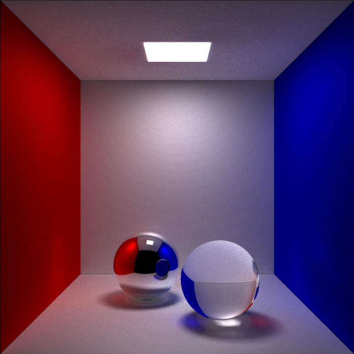

# CudaRayTracer

**CudaRayTracer** - a custom ray tracer originally developed during university studies to run on CPU, now ported to GPU using CUDA. This project was created to explore GPU rendering techniques and to gain hands-on experience with CUDA programming.

## 🔎 Table of Contents

- [✅ Overview](#-overview)
- [✨ Features](#-features)
- [🧰 Libraries Used](#-libraries-used)
- [⚙️ Requirements](#%EF%B8%8F-requirements)
- [🛠️ Build and Run](#%EF%B8%8F-build-and-run)
- [⚙️ Rendering Settings](#%EF%B8%8F-rendering-settings)
- [🖼️ Render Preview](#%EF%B8%8F-render-preview)
- [📂 Project Structure](#-project-structure)
- [📌 Notes](#-notes)
- [👥 Authors](#-authors)
- [📜 License](#-license)

## ✅ Overview

**CudaRayTracer** is a ray tracer implementation optimized for GPU execution with CUDA. Main goals:
- Experiment with GPU-based rendering.
- Gain practical CUDA programming experience.
- Learn how raytracing works.

## ✨ Features

- **Adaptive Antialiasing**
  - Pixels are split into 4 parts (*boxes*).
  - Each box can be subdivided recursively (up to 4 levels – CUDA limitation).
  - If all 4 corners of a box have the same color, subdivision stops (*early termination*).

- **Global Illumination**
  - Realistic lighting with reflections from other objects.

- **Area Light with LTC (Linearly Transformed Cosines)**
  - Accurate and efficient surface light representation.

- **Colored Materials**
  - **Diffuse** – scatters light.
  - **Reflective** – reflects light (mirror-like).
  - **Refractive** – bends light (e.g., glass).
  - Each material can have its own color.

- **Scene**
  - Default scene is a **Cornell Box** with two spheres:
    - One **refractive**.
    - One **reflective**.
  - Scene is defined **directly in the source code**.

- **File Output**
  - Rendered image is saved in `.hdr` format as `file.hdr`.

## 🧰 Libraries Used

- [**SFML**](https://www.sfml-dev.org/) – window and display handling.
- [**stb_image_write**](https://github.com/nothings/stb) – saving images to files.
- [**stb_image**](https://github.com/nothings/stb) – loading textures (LTC).
- [**mstd**](https://github.com/MAIPA01/mstd) – math library (modified for CUDA compatibility).

📦 **Installation via vcpkg**

All external libraries are managed using [**vcpkg**](https://github.com/microsoft/vcpkg):

```bash
vcpkg install sfml stb
```

## ⚙️ Requirements

- **Windows 10/11**
- **Visual Studio 2022**
- **CUDA Toolkit** (recommended 12.9)
- **NVIDIA GPU with CUDA support**
- **C++20** (MSVC compiler)

## 🛠️ Build and Run

1. Open `CudaRayTracer.sln` in **Visual Studio 2022**.
2. Set configuration to `Release` or `Debug`.
3. Ensure the project uses CUDA Runtime.
4. Run (`Ctrl+F5`).

After rendering, the image will first be displayed in a window, and upon closing it, saved as `file.hdr`.

## ⚙️ Rendering Settings

- **renderAllAtOnce** *(bool)* – if `true`, rendering is done in one kernel and the entire image is displayed at once.  
  If `false`, the image is rendered in multiple kernels, each responsible for a specific part, with results shown after each.
- **blocksPerDraw** *(int)* – relevant only when `renderAllAtOnce = false`; defines how many blocks one kernel processes.
- **nx**, **ny** *(int)* – image resolution.
- **tx**, **ty** *(int)* – block size. For CUDA devices supporting 1024 threads per block, the largest square block is 19×19.
- **aa_iter** *(int)* – number of antialiasing iterations (max 4).
- **ref_iter** *(int)* – number of ray iterations for refraction and reflection.
- **gl_iter** *(int)* – number of iterations for global illumination calculations.
- **ind_rays** *(int)* – number of rays per hemisphere for global illumination (more rays = less noise).
- **shadowSamples** *(int)* – number of rays used for shadow calculation.

## 🖼️ Render Preview

Example outputs (Cornell Box):

<p align="center">
  
</p>

> Example 1: nx = 720, ny = 720, aa_iter = 1, ref_iter = 4, gl_iter = 0, ind_rays = 75, shadowSamples = 50

<p align="center">
  
</p>

> Example 2: nx = 720, ny = 720, aa_iter = 1, ref_iter = 4, gl_iter = 2, ind_rays = 75, shadowSamples = 50

<p align="center">
  
</p>

> Example 3: nx = 720, ny = 720, aa_iter = 1, ref_iter = 4, gl_iter = 3, ind_rays = 75, shadowSamples = 50

The `.hdr` file can be opened in HDR viewers or converted to `.png` and other formats.

## 🖥️ Benchmark

| Global Illumination Ray Bounces | NVIDIA GeForce RTX 4070 Ti SUPER | NVIDIA GeForce RTX 3060 Laptop GPU |
| ------------------------------- | -------------------------------- | ---------------------------------- |
| 0 | 00:00:00.000 | 00:00:00.000 |
| 1 | 00:00:00.000 | 00:00:00.000 |
| 2 | 00:00:00.000 | 00:00:00.000 |
| 3 | 06:24:00.602 |  NOT MESURED |

> Rest of parameters was: nx = 720, ny = 720, aa_iter = 1, ref_iter = 4, ind_rays = 75, shadowSamples = 50

## 📂 Project Structure

```
.
├── renders/            # Generated images
├── CudaRayTracer.sln   # Visual Studio 2022 solution
├── LICENSE             # License
└── README.md
```

## 📌 Notes

- Scene is defined in code (no external file loading).
- Adaptive antialiasing limited to 4 levels (CUDA).
- Performance depends on the GPU used.
- Rendering settings are modified in the source code.

## 👥 Authors

Project created by two students while learning and exploring ray tracing techniques with CUDA:

- [**Muppetsg2**](https://github.com/Muppetsg2)
- [**MAIPA01**](https://github.com/MAIPA01)

## 📜 License

📝 This project is licensed under the MIT License.  

- ✅ Free to use, modify, and distribute.  
- ✅ Suitable for commercial and non-commercial use.  
- ❗ Must include the original license and copyright.  

See the [LICENSE](./LICENSE) file for details.