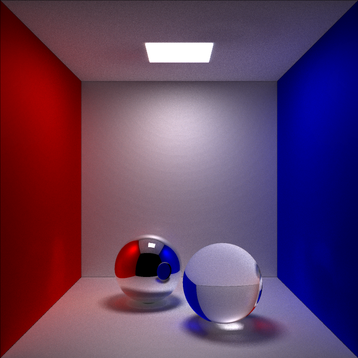

# CudaRayTracer

**CudaRayTracer** - a custom ray tracer originally developed during university studies to run on CPU, now ported to GPU using CUDA. This project was created to explore GPU rendering techniques and to gain hands-on experience with CUDA programming.

## 🔎 Table of Contents

- [✅ Overview](#-overview)
- [✨ Features](#-features)
- [🧰 Libraries Used](#-libraries-used)
- [⚙️ Requirements](#%EF%B8%8F-requirements)
- [🛠️ Build and Run](#%EF%B8%8F-build-and-run)
- [⚙️ Rendering Settings](#%EF%B8%8F-rendering-settings)
- [🖼️ Render Preview](#%EF%B8%8F-render-preview)
- [🖥️ Benchmark](#%EF%B8%8F-benchmark)
- [📂 Project Structure](#-project-structure)
- [📌 Notes](#-notes)
- [👥 Authors](#-authors)
- [📜 License](#-license)

## ✅ Overview

**CudaRayTracer** is a ray tracer implementation optimized for GPU execution with CUDA. Main goals:
- Experiment with GPU-based rendering.
- Gain practical CUDA programming experience.
- Learn how raytracing works.

## ✨ Features

- **Adaptive Antialiasing**
  - Pixels are split into 4 parts (*boxes*).
  - Each box can be subdivided recursively (up to 4 levels – CUDA limitation).
  - If all 4 corners of a box have the same color, subdivision stops (*early termination*).

- **Global Illumination**
  - Realistic lighting with reflections from other objects.

- **Area Light with LTC (Linearly Transformed Cosines)**
  - Accurate and efficient surface light representation.

- **Colored Materials**
  - **Diffuse** – scatters light.
  - **Reflective** – reflects light (mirror-like).
  - **Refractive** – bends light (e.g., glass).
  - Each material can have its own color.

- **Scene**
  - Default scene is a **Cornell Box** defined in [`renders/cornellbox.yaml`](./renders/cornellbox.yaml), containing two spheres:
    - One **refractive**.
    - One **reflective**.
  - The scene is defined by a **YAML file**, and its path can be set in `settings.ini` using the parameter: `world_file_path`.

- **Settings**
  - Default settings are automatically created in the executable directory if no `settings.ini` file is found.
  - An example `settings.ini` file can be found in [`renders/settings.ini`](./renders/settings.ini)

- **File Output**
  - The rendered image is saved in **HDR** format at the location specified in the settings, using the configured file name.

## 🧰 Libraries Used

- [**SFML**](https://www.sfml-dev.org/) – Window and display handling.
- [**yaml-cpp**](https://github.com/jbeder/yaml-cpp) - Loading scene description from YAML file.
- [**stb_image_write**](https://github.com/nothings/stb) – Saving rendered image to file.
- [**stb_image**](https://github.com/nothings/stb) – Loading textures (LTC).
- [**mstd**](https://github.com/MAIPA01/mstd) – Math library (modified for CUDA compatibility).

📦 **Installation via vcpkg**

All external libraries are managed using [**vcpkg**](https://github.com/microsoft/vcpkg):

```bash
vcpkg install sfml yaml-cpp
```

## ⚙️ Requirements

- **Windows 10/11**
- **Visual Studio 2022**
- **CUDA Toolkit** (recommended 12.9)
- **NVIDIA GPU with CUDA support**
- **C++20** (MSVC compiler)

## 🛠️ Build and Run

1. Open `CudaRayTracer.sln` in **Visual Studio 2022**.
2. Set configuration to `Release` or `Debug`.
3. Ensure the project uses CUDA Runtime.
4. Run (`Ctrl+F5`).

After rendering, the image will first be displayed in a window, and upon closing it, saved as **HDR** file according to settings.

## ⚙️ Rendering Settings

Rendering behavior and output are configured in the `settings.ini` file. The file is divided into three main sections:

**[Draw]**
- **render_all_at_once** *(bool)* – If `true`, the image is rendered in a single kernel and displayed at once. If `false`, rendering is split into multiple kernels, each processing a portion of the image, with partial results shown progressively.
- **blocks_per_draw** *(int)* – Used only when `render_all_at_once = false`; specifies how many blocks one kernel processes.
- **world_file_path** *(string)* – Path to the YAML file describing the scene (can be relative to the executable or absolute).

**[Image]**
- **image_width**, **image_height** *(int)* – Output image resolution.
- **file_name** *(string)* – Name of the output file (without extension). You can include time tags compatible with `strftime` to automatically insert timestamps.
- **output_path** *(string)* – Path where the output file will be saved (can be relative or absolute).

**[Quality]**
- **aa_iter** *(int)* – Number of anti-aliasing iterations (max: 4).
- **ref_iter** *(int)* – Number of ray iterations for refraction and reflection.
- **gl_iter** *(int)* – Number of iterations for global illumination (i.e., the number of global ray bounces).
- **ind_rays** *(int)* – Number of rays per hemisphere for global illumination (higher values reduce noise).
- **shadow_samples** *(int)* – Number of rays used for shadow calculation.

**CUDA Block Size**

If your CUDA device does not support 1024 threads per block, you can adjust the **tx** and **ty** parameters in the `main.cu` file (inside the *Parameters* section). These define the block size. 
> For CUDA devices supporting 1024 threads per block, the largest square block size is **19×19**.

## 🖼️ Render Preview

Example outputs (Cornell Box):

<p align="center">
  
</p>

> Example 1: image_width = 720, image_height = 720, aa_iter = 1, ref_iter = 4, gl_iter = 0, ind_rays = 75, shadow_samples = 50

<p align="center">
  
</p>

> Example 2: image_width = 720, image_height = 720, aa_iter = 1, ref_iter = 4, gl_iter = 2, ind_rays = 75, shadow_samples = 50

<p align="center">
  
</p>

> Example 3: image_width = 720, image_height = 720, aa_iter = 1, ref_iter = 4, gl_iter = 3, ind_rays = 75, shadow_samples = 50

The `.hdr` file can be opened in HDR viewers or converted to `.png` and other formats.

## 🖥️ Benchmark

Tested parameters:
`image_width = 720`, `image_height = 720`, `aa_iter = 1`, `ref_iter = 4`, `ind_rays = 75`, `shadow_samples = 50`

| 🌐 GL Ray Bounces | ⚡ RTX 4070 Ti SUPER | ⚡ RTX 3060 Laptop GPU |
| ------------------------------- | -------------------------------- | ---------------------------------- |
| 0 | ⏱️ 0.116 s | ⏱️ 0.350 s |
| 1 | ⏱️ 10.438 s	 | ⏱️ 23.596 s |
| 2 | ⏱️ 9 min 34.214 s | ⏱️ 29 min 50.129 s |
| 3 | ⏱️ 6 h 24 min 0.602 s |  ❌ *Not measured* |

> Legend: 
>   - **GL Ray Bounces** – number of ray bounces in Global Illumination calculations. Corresponds to the `gl_iter` parameter.
>   - Time measured in Release mode.
>   - ❌ – measurement not performed.

## 📂 Project Structure

```
.
├── renders/            # Generated images and Cornell Box scene file
├── CudaRayTracer.sln   # Visual Studio 2022 solution
├── LICENSE             # License
└── README.md
```

## 📌 Notes

- Scene is defined in external YAML file.
- Adaptive antialiasing limited to 4 levels (CUDA).
- Performance depends on the GPU used.
- Rendering settings are modified in the settings.ini file.

## 👥 Authors

Project created by two students while learning and exploring ray tracing techniques with CUDA:

- [**Muppetsg2**](https://github.com/Muppetsg2)
- [**MAIPA01**](https://github.com/MAIPA01)

## 📜 License

📝 This project is licensed under the MIT License.  

- ✅ Free to use, modify, and distribute.  
- ✅ Suitable for commercial and non-commercial use.  
- ❗ Must include the original license and copyright.  

See the [LICENSE](./LICENSE) file for details.